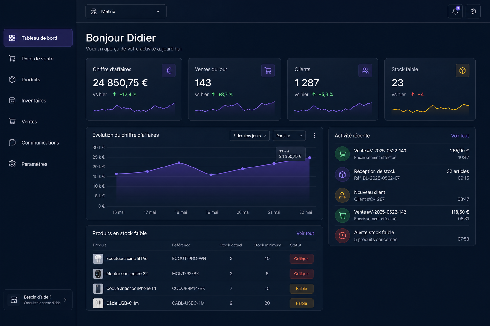
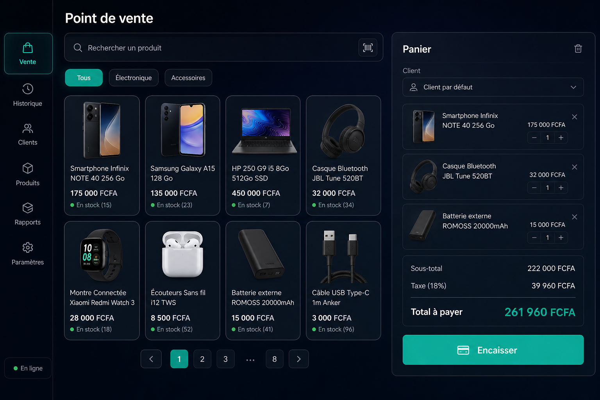
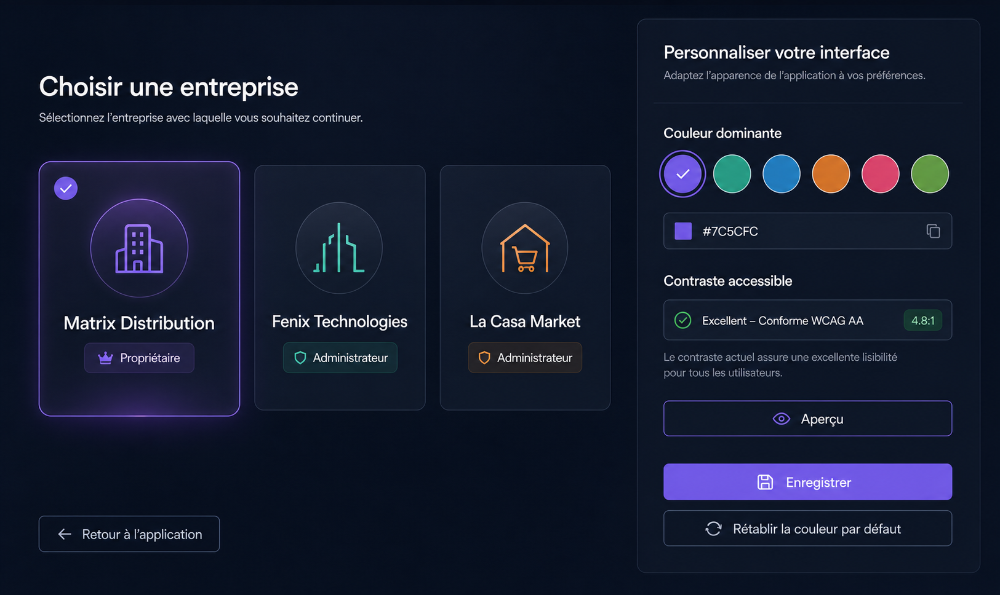

# Cahier des charges — Design system et harmonisation UI/UX

Version : 1.7 — 3 septembre 2026
Statut : direction validée — composants principaux implémentés, contrôles et extensions à maintenir

## 1. Vision

Créer une identité visuelle SaaS moderne, professionnelle et mémorable, fondée sur un glassmorphisme maîtrisé, un flou léger, des halos doux et des micro-interactions discrètes.

L’interface doit rester :

- claire avant d’être spectaculaire ;
- rapide sur ordinateur comme sur téléphone ;
- adaptée à une utilisation professionnelle quotidienne ;
- cohérente entre POS, administration, paramètres, e-commerce et authentification ;
- suffisamment sobre pour ne pas donner l’impression d’un thème généré automatiquement ;
- accessible aux utilisateurs peu techniques ;
- compatible avec les écrans modestes et les connexions mobiles instables.

Le design ne doit jamais ralentir une vente, masquer une information métier ou transformer chaque élément en surface vitrée.

## 2. Direction artistique

### 2.1 Personnalité recherchée

La marque doit évoquer : fiabilité, fluidité, précision, modernité et proximité.

Le style retenu est un **glassmorphisme fonctionnel** : surfaces sombres légèrement translucides, séparation nette des niveaux, bordures fines, reflets limités et profondeur douce. Les effets sont concentrés sur les zones structurantes plutôt que répétés sur chaque composant.

### 2.2 Principes visuels

1. Une action principale clairement identifiable par écran.
2. Une profondeur maximale de trois niveaux visuels.
3. Un seul halo dominant par zone importante.
4. Des surfaces lisibles même lorsque `backdrop-filter` n’est pas disponible.
5. Les données, totaux et statuts restent plus visibles que les effets décoratifs.
6. Les animations expliquent une action ou un changement d’état ; elles ne décorent pas gratuitement.
7. Les textes utilisent un français naturel, non technique et orienté vers l’action.

### 2.3 Ce qu’il faut éviter

- flou excessif derrière les tableaux et formulaires ;
- halos multicolores permanents ;
- dégradés sur tous les boutons ;
- bordures lumineuses trop fortes ;
- animations élastiques ou rebonds répétés ;
- multiplication d’icônes sans fonction ;
- textes trop génériques ou artificiels ;
- cartes imbriquées à plus de trois niveaux ;
- transparence réduisant le contraste ;
- apparence « dashboard de démonstration » au détriment du métier.

### 2.4 Maquettes d’intention

Les maquettes suivantes illustrent la direction visuelle, la hiérarchie, la densité et l’usage des couleurs personnalisables. Elles servent de référence de discussion avant la conception des composants réels. Elles ne figent ni les données, ni tous les libellés, ni l’emplacement définitif des fonctions existantes.

#### Tableau de bord — dominante violette



Cette piste montre une navigation compacte, des statistiques lisibles, des surfaces vitrées limitées aux cartes et un halo réservé aux éléments actifs.

#### Point de vente — dominante turquoise



Le POS conserve des surfaces plus opaques et une forte densité fonctionnelle. La couleur personnelle met en évidence la sélection et l’action d’encaissement sans concurrencer les prix, stocks et totaux.

#### Sélection de compagnie et personnalisation



Cette piste présente les noms complets des entreprises, le rôle de l’utilisateur, le retour vers l’application et un sélecteur de couleur avec aperçu et contrôle de contraste.

## 3. Fondations et tokens

Tous les choix visuels doivent être exprimés avec des variables CSS centralisées. Aucun nouveau module ne doit introduire sa propre palette ou ses propres rayons sans justification.

### 3.1 Palette sombre principale

| Token | Valeur indicative | Usage |
|---|---|---|
| `--ds-bg-canvas` | `#070B14` | fond général |
| `--ds-bg-elevated` | `#0D1422` | navigation et zones fixes |
| `--ds-glass-1` | `rgba(18, 27, 45, .72)` | panneaux principaux |
| `--ds-glass-2` | `rgba(24, 35, 56, .82)` | modales et surfaces prioritaires |
| `--ds-border-soft` | `rgba(255,255,255,.09)` | séparation standard |
| `--ds-border-strong` | `rgba(255,255,255,.16)` | focus structurel |
| `--ds-text-primary` | `#F4F7FB` | titres et valeurs |
| `--ds-text-secondary` | `#A9B5C8` | textes secondaires |
| `--ds-text-muted` | `#74839A` | métadonnées |
| `--ds-accent` | `#FF9F43` par défaut | action principale et identité choisie par l’utilisateur |
| `--ds-accent-hover` | dérivée de `--ds-accent` | survol principal |
| `--ds-success` | `#35C98B` | réussite et disponibilité |
| `--ds-danger` | `#FF626E` | danger et suppression |
| `--ds-warning` | `#F5B942` | avertissement |
| `--ds-info` | `#55A7FF` | information |

Les couleurs doivent être testées selon WCAG AA. Une couleur n’est jamais le seul moyen de communiquer un statut : ajouter texte, icône ou forme.

### 3.2 Couleur dominante personnalisable par utilisateur

Chaque utilisateur authentifié peut choisir la couleur dominante de son interface depuis son profil. Ce choix est une préférence personnelle : il ne modifie ni le thème des autres membres, ni l’identité publique de l’entreprise, ni la boutique e-commerce.

Le sélecteur propose :

- une palette courte de couleurs professionnelles validées ;
- un sélecteur libre au format hexadécimal pour les utilisateurs avancés ;
- un aperçu immédiat sur un bouton, une carte, un lien actif et un anneau de focus ;
- une action **Rétablir la couleur par défaut** ;
- un loader dans le bouton d’enregistrement et le blocage des doubles clics.

La préférence est enregistrée côté serveur dans le profil utilisateur afin de suivre l’utilisateur sur ordinateur, mobile et PWA. Une copie locale peut accélérer le premier rendu, mais la valeur serveur reste la source de vérité. La couleur est appliquée dès le chargement dans un attribut du document et exposée par des variables CSS, sans feuille de style supplémentaire.

Variables dérivées obligatoires :

```css
--ds-accent: #FF9F43;
--ds-accent-hover: /* variante légèrement plus claire ou plus sombre */;
--ds-accent-active: /* variante pressée */;
--ds-accent-soft: /* accent à faible opacité pour fonds et halos */;
--ds-accent-contrast: /* texte noir ou blanc calculé */;
--ds-focus-ring: /* anneau accessible dérivé de l’accent */;
```

Garde-fous :

- calcul automatique d’un texte noir ou blanc garantissant un contraste WCAG AA ;
- rejet ou correction des couleurs trop proches du fond et impossibles à rendre accessibles ;
- aperçu accompagné d’un avertissement avant enregistrement si la couleur doit être ajustée ;
- couleur par défaut `#FF9F43` en cas de valeur absente, invalide ou héritée d’un ancien compte ;
- aucune utilisation de la couleur personnalisée pour les statuts succès, danger, avertissement ou information ;
- aucune requête réseau supplémentaire à chaque changement d’écran ;
- changement limité aux tokens CSS pour conserver un rendu instantané et léger.

L’évolution peut prévoir ultérieurement une couleur de marque définie par le propriétaire de la compagnie. Dans ce cas, l’ordre de priorité sera : préférence personnelle de l’utilisateur, couleur de la compagnie, couleur par défaut de l’application.

### 3.3 Modes sombre, clair et système

Le mode clair fait partie du périmètre initial du design system. Chaque utilisateur dispose de trois choix dans son profil : **Sombre**, **Clair** et **Selon l’appareil**. Le choix **Selon l’appareil** suit `prefers-color-scheme` et réagit à un changement du système sans exiger de reconnexion.

Les deux thèmes partagent la même structure, les mêmes espacements et les mêmes composants. Seuls les tokens de surfaces, textes, bordures, ombres, verre et contraste changent. Aucun écran ne doit maintenir deux feuilles CSS indépendantes.

Principes du mode clair :

- fond général blanc cassé ou gris bleuté très léger, jamais blanc agressif sur toute la surface ;
- panneaux vitrés légèrement translucides mais suffisamment opaques pour rester lisibles ;
- texte principal très sombre et texte secondaire clairement contrasté ;
- ombres plus courtes et plus diffuses que dans le thème sombre ;
- soft glow fortement réduit afin d’éviter un effet fluorescent ;
- couleur dominante personnelle conservée, avec variantes recalculées pour le fond clair ;
- graphiques, tableaux, éditeurs, modales, e-mails prévisualisés et états vides testés dans les deux modes.

Le thème est appliqué avant le premier rendu utile pour éviter un flash clair en mode sombre ou inversement. La préférence serveur reste la source de vérité ; une valeur locale synchronisée permet l’application immédiate lors du démarrage de la PWA. Les pages publiques peuvent utiliser le mode système par défaut.

### 3.4 Typographie

Utiliser en priorité une pile système afin d’éviter un téléchargement de police bloquant :

```css
font-family: Inter, ui-sans-serif, system-ui, -apple-system, "Segoe UI", sans-serif;
```

Si `Inter` n’est pas déjà distribuée localement, la pile système suffit. Ne pas charger plus de trois graisses.

Échelle recommandée :

- titre de page : 28–32 px, graisse 700 ;
- titre de section : 20–22 px, graisse 650 ;
- titre de carte : 16–18 px, graisse 600 ;
- corps : 14–16 px ;
- métadonnées : 12–13 px ;
- valeur statistique : 26–34 px avec chiffres tabulaires.

La hauteur de ligne minimale du corps est `1.5`. Les paragraphes dépassant 70 caractères de largeur doivent être évités.

### 3.5 Espacement et grille

Base : 4 px. Valeurs autorisées : 4, 8, 12, 16, 20, 24, 32, 40 et 48 px.

- largeur maximale du contenu administratif : 1440 px ;
- gouttière ordinateur : 24–32 px ;
- tablette : 20–24 px ;
- mobile : 16 px ;
- espacement entre sections : 24–32 px ;
- hauteur tactile minimale : 44 px.

### 3.6 Rayons, bordures et ombres

- petit contrôle : 8 px ;
- bouton et champ : 10–12 px ;
- carte : 16 px ;
- modale importante : 20 px ;
- pilule : 999 px uniquement pour badges et filtres courts.

Une carte standard utilise une bordure de 1 px et une ombre douce. Les ombres noires fortes sont réservées aux modales. Les halos doivent utiliser l’accent avec une opacité maximale d’environ 12 %.

### 3.7 Niveaux de verre

- **Niveau 0** : fond opaque pour les tableaux denses et le POS critique.
- **Niveau 1** : verre léger pour cartes, filtres et navigation.
- **Niveau 2** : verre renforcé pour modales, sélecteur de compagnie et authentification.

Valeur indicative : `backdrop-filter: blur(12px) saturate(115%)`. Sur mobile ou appareil moins puissant, réduire à 8 px. Fournir systématiquement un fond opaque de secours.

## 4. Architecture des écrans

### 4.1 Navigation principale

- menu regroupé par domaine métier ;
- un seul niveau de sous-menu visible à la fois ;
- élément actif identifiable par fond, repère latéral et texte ;
- possibilité de réduire le menu sur ordinateur ;
- tiroir mobile plein écran partiel avec fermeture explicite ;
- entreprise active toujours visible sans dominer l’écran ;
- changement d’entreprise accessible en deux actions maximum ;
- fonctions sans permission totalement absentes du menu.

### 4.2 En-tête de page

Ordre stable : fil d’Ariane facultatif, titre, courte description, action principale, actions secondaires.

Les exports et filtres restent dans leurs accordéons dédiés. Une page ne doit pas afficher plus de deux boutons fortement colorés dans son en-tête.

### 4.3 Tableaux

- en-tête lisible et éventuellement fixe ;
- lignes de 52–60 px ;
- alignement numérique à droite ;
- actions regroupées dans un menu ou un groupe compact ;
- filtres conservés dans l’URL ;
- pagination toujours visible ;
- squelette ou état de chargement pour les résultats distants ;
- état vide avec explication et prochaine action.

Sur mobile, les tableaux prioritaires deviennent des cartes synthétiques. Le défilement horizontal reste un secours pour les tableaux financiers complexes.

#### 4.3.1 Contrat visuel unique des DataTables

Toutes les DataTables du SaaS doivent donner l’impression d’utiliser un seul composant, quel que soit le module. Les variantes locales ne sont admises que pour la densité ou les colonnes métier, jamais pour réinventer les couleurs, les champs de recherche, la pagination ou les états.

Anatomie obligatoire :

1. un conteneur de surface opaque ou verre niveau 0, avec bordure et rayon de carte ;
2. une barre d’outils comprenant, dans cet ordre logique, longueur de page, recherche et actions secondaires éventuelles ;
3. un tableau avec en-tête contrasté, lignes séparées et zone d’actions compacte ;
4. un pied comprenant le compteur de résultats puis la pagination ;
5. des états chargement, vide et erreur contenus dans la même surface, sans changement brutal de hauteur.

Règles visuelles strictes :

- utiliser exclusivement les tokens `--ds-*` pour fonds, textes, bordures, accent, focus et ombres ;
- ne jamais injecter des couleurs avec jQuery dans `drawCallback`, `rowCallback` ou après chaque chargement ;
- ne jamais imposer `black`, `white`, un fond sombre ou un texte clair en JavaScript ;
- champs DataTables de 40–44 px, rayon 10 px et focus de 3 px ;
- en-tête de 44–48 px, libellés de 12–13 px, graisse 750 et contraste AA ;
- lignes de 52–60 px sur ordinateur, avec densité compacte explicitement nommée si un écran métier l’exige ;
- valeurs numériques et monétaires alignées à droite avec chiffres tabulaires ;
- dates, statuts et actions non coupés arbitrairement ; les intitulés longs utilisent ellipse et `title` accessible ;
- action principale identifiable, actions secondaires regroupées, suppression toujours distincte et confirmée ;
- pagination composée de boutons d’au moins 36 px, état courant visible autrement que par la couleur ;
- recherche avec libellé accessible, état de chargement annoncé et aucun faux résultat affiché avant la réponse.

Règles techniques strictes :

- conserver la pagination, la recherche et le tri côté serveur pour les listes volumineuses ;
- déclarer les colonnes calculées comme non recherchables/non triables lorsqu’elles n’existent pas en SQL ;
- ne jamais exposer une colonne, une valeur financière ou une action interdite par permission, même si elle est masquée visuellement ;
- centraliser les styles dans le design system ou la feuille SaaS partagée ; aucune nouvelle DataTable ne doit embarquer un bloc de styles complet dans sa vue ;
- initialiser le composant une seule fois et ne pas dupliquer les gestionnaires après `draw` ;
- restaurer filtres, focus et boutons après succès ou erreur ; les attentes serveur utilisent `window.ServerButtonLoader` ;
- vérifier au minimum recherche, tri, pagination, zéro résultat, erreur réseau simulée, thème clair/sombre, permission réduite et changement de compagnie ;
- sur 320–767 px, choisir explicitement entre cartes synthétiques et défilement local. Le document entier ne doit jamais déborder horizontalement.

La classe ou le composant partagé définitif devra être documenté ici dès sa création. En attendant sa généralisation, toute migration doit reproduire ce contrat sans créer une nouvelle convention concurrente.

### 4.4 Formulaires

- libellé toujours visible au-dessus du champ ;
- aide courte sous le champ uniquement si nécessaire ;
- groupes longs répartis en sections, onglets ou accordéons ;
- erreurs placées près du champ et résumées en haut ;
- champs obligatoires indiqués sans surcharge ;
- boutons de révélation sur tous les mots de passe ;
- action principale fixe ou facilement accessible sur les longs formulaires mobiles.

#### 4.4.1 Contrat des modales flottantes et panneaux contextuels

Une modale n’est pas une page miniature. Elle sert à confirmer, choisir, consulter un détail court ou terminer une action concentrée. Un formulaire long ou un tableau complexe doit devenir une page ou un panneau plein écran adapté.

Anatomie obligatoire :

1. backdrop unique assombrissant la page sans la rendre illisible ;
2. conteneur verre niveau 2 avec fond opaque de secours, bordure, rayon de 20 px et ombre forte réservée à cette profondeur ;
3. en-tête fixe contenant repère facultatif, titre explicite, description courte éventuelle et fermeture accessible ;
4. corps seul défilable ;
5. pied fixe contenant action secondaire puis action principale, avec zone sûre mobile ;
6. états chargement, vide, erreur et succès rendus dans le corps sans fermer prématurément la modale.

Dimensions de référence :

- petite confirmation : 420–480 px ;
- formulaire standard : 560–680 px ;
- détail riche ou reçu : 760–960 px ;
- largeur maximale : `calc(100vw - 32px)` sur ordinateur ;
- sous 768 px : panneau plein écran ou feuille inférieure selon la longueur, avec hauteur `100dvh`, zones sûres et fermeture toujours visible.

Comportements stricts :

- une seule modale interactive à la fois ; aucune modale imbriquée ;
- ouverture en 220–280 ms maximum, uniquement `transform` et `opacity`, sans animation avec `prefers-reduced-motion` ;
- focus initial placé sur le titre, le premier champ pertinent ou l’action sûre ; focus piégé dans la modale puis restauré sur le déclencheur à la fermeture ;
- touche Échap autorisée sauf pendant une opération serveur non interrompable ; bouton de fermeture toujours nommé pour les lecteurs d’écran ;
- le backdrop, la modale et les menus Select2 doivent respecter une échelle de `z-index` commune, sans valeurs extrêmes ajoutées localement ;
- aucune fermeture automatique sur erreur ; afficher le message exploitable près de l’action concernée ;
- aucune confirmation destructive par simple couleur : titre, conséquence et libellé d’action doivent être explicites ;
- toute action serveur bloque le double clic, affiche son loader dans le bouton et ne montre le succès qu’après réponse positive ;
- ne jamais coder des fonds blancs/textes noirs propres à un thème ; utiliser les tokens et tester clair, sombre et système ;
- ne pas déplacer dans une modale un sélecteur ou une logique métier sans conserver ses IDs, permissions, validation serveur et isolation tenant.

Pour le POS, `pos-modal-content` est la classe transitoire commune des modales reçu, détail et commandes en cours. Elle doit converger vers `x-ui.modal` sans modifier `#pdfModal`, les sélecteurs de livraison de facture ni les contrats JavaScript existants. Toute nouvelle modale doit utiliser le composant partagé lorsqu’il existe ; il est interdit de créer une quatrième convention locale.

Recette minimale : ouverture clavier et souris, fermeture bouton/Échap, restauration du focus, contenu long, erreur serveur, double clic, 200 % de zoom, 390 px, 768 px et 1440 px, sans débordement global ni erreur console.

### 4.5 POS

Le POS privilégie la vitesse sur le verre : catalogue, panier, quantités et paiement utilisent des fonds plus opaques.

- animation produit-vers-panier courte et visible depuis le point de clic ;
- total et bouton de validation toujours immédiatement accessibles ;
- retour tactile/visuel après modification de quantité ;
- panier persistant clairement signalé après restauration ;
- aucune animation ne doit bloquer l’ajout rapide de plusieurs produits.

### 4.6 Administration SaaS

- identité plus institutionnelle que le POS ;
- cartes statistiques sobres ;
- alertes critiques dominantes sans halo permanent ;
- actions sensibles isolées visuellement ;
- historique et audit denses, mais faciles à filtrer ;
- paramètres divisés en Général, Services, Sécurité, Maintenance et Tarification.

### 4.7 Authentification, invitations et sélection de compagnie

Ces interfaces utilisent le verre de niveau 2 avec une illustration ou un halo unique. Le formulaire conserve un contraste fort, un contour net et une zone interne scrollable sur mobile.

La sélection de compagnie affiche nom complet, logo, rôle et indicateur d’activité. Les cartes doivent rester faciles à distinguer, même lorsque plusieurs entreprises ont des noms proches.

### 4.8 Matrice responsive SaaS

Chaque fonctionnalité doit être conçue et validée pour les largeurs suivantes, sans se limiter à une simulation générique « ordinateur/mobile » :

| Palier | Largeur indicative | Comportement attendu |
|---|---:|---|
| petit mobile | 320–374 px | une colonne, actions prioritaires accessibles, aucun débordement global |
| mobile | 375–479 px | cartes compactes, navigation en tiroir, zones tactiles de 44 px minimum |
| grand mobile | 480–767 px | meilleure exploitation de la largeur sans densité excessive |
| tablette portrait | 768–1023 px | grille intermédiaire, panneaux secondaires repliables |
| tablette paysage / petit portable | 1024–1279 px | menu compact, tableaux adaptés et POS utilisable au tactile |
| ordinateur | 1280–1599 px | layout complet, densité métier standard |
| grand écran | 1600 px et plus | largeur de lecture maîtrisée, colonnes supplémentaires utiles, aucun étirement artificiel |

Règles transversales :

- approche mobile-first pour les composants nouveaux ;
- prise en charge portrait et paysage, y compris après rotation ;
- respect des zones sûres iPhone via `env(safe-area-inset-*)` dans la PWA ;
- aucune action critique dépendante du survol ;
- clavier virtuel ne masquant ni le champ actif, ni la validation ;
- modales transformées en panneaux plein écran ou feuilles inférieures lorsque l’espace l’exige ;
- graphiques redimensionnables, légendes repliables et valeurs accessibles sans survol ;
- tableaux transformés en cartes lorsque la lecture métier le permet, sinon défilement local clairement signalé ;
- barres d’actions importantes collantes, sans masquer le contenu ;
- images responsives avec dimensions déclarées pour éviter les décalages de mise en page ;
- textes utilisables avec un zoom navigateur à 200 % ;
- tests tactiles sur Android et iOS, tests clavier/souris sur ordinateur ;
- prise en compte des états chargement, vide, erreur, hors ligne et contenu anormalement long à chaque palier.

Le POS, les formulaires, les tableaux, la sélection de compagnie, l’administration centrale, la boutique e-commerce et le checkout KPrimePay constituent des parcours responsives prioritaires. Les iframes ou pages externes doivent disposer d’un repli explicite lorsqu’elles ne peuvent pas s’adapter correctement.

## 5. Composants normalisés

Créer progressivement une bibliothèque Blade réutilisable :

- `x-ui.button` ;
- `x-ui.input`, `select`, `textarea` et `password` ;
- `x-ui.card` et `glass-panel` ;
- `x-ui.badge` et `status` ;
- `x-ui.modal` ;
- `x-ui.alert` et `toast` ;
- `x-ui.empty-state` ;
- `x-ui.stat-card` ;
- `x-ui.table-shell` ;
- `x-ui.filter-panel` et `export-panel` ;
- `x-ui.company-card` ;
- `x-ui.skeleton` ;
- `x-ui.permission-denied`.

Chaque composant doit accepter des variantes explicites plutôt que des styles libres : `primary`, `secondary`, `success`, `danger`, `warning`, `ghost`.

## 6. Interactions et mouvement

### 6.1 Durées

- retour immédiat : 80–120 ms ;
- bouton, champ et survol : 140–180 ms ;
- accordéon et menu : 180–240 ms ;
- modale et transition de page : 220–280 ms ;
- animation produit-vers-panier : 450–650 ms maximum.

Courbe principale : `cubic-bezier(.2,.8,.2,1)`.

### 6.2 Micro-interactions

- clic bouton : translation verticale de 1 px et légère réduction à `0.985` ;
- carte interactive : déplacement maximal de 2 px au survol ;
- focus : anneau clair de 3 px, jamais seulement un changement de couleur ;
- succès : coche ou halo unique de moins de 400 ms ;
- erreur : aucune secousse agressive ; utiliser bordure, icône et message ;
- badges et totaux peuvent utiliser une transition douce lorsqu’une valeur change.

Respecter `prefers-reduced-motion: reduce` : supprimer trajectoires, zooms et parallaxes, conserver uniquement les changements d’état immédiats.

## 7. Attente des actions serveur

Toute action déclenchée par l’utilisateur qui attend le serveur doit afficher un loader dans le bouton et empêcher les doubles clics jusqu’à la réponse.

Le composant global est `window.ServerButtonLoader`, défini dans `public/hub/assets/js/server-button-loader.js`. Il couvre les formulaires HTML et les appels jQuery/Fetch immédiats.

```html
<button type="submit" data-loading-text="Enregistrement…">Enregistrer</button>
```

Pour Axios, un Fetch différé ou un traitement personnalisé :

```javascript
await ServerButtonLoader.withLoader(button, requestPromise, 'Envoi en cours…');
```

Une confirmation SweetAlert utilise `showLoaderOnConfirm`, exécute la requête dans `preConfirm` et interdit la fermeture pendant `Swal.isLoading()`. Après une erreur, le bouton est restauré et le message reste exploitable. Aucun succès n’est affiché avant la réponse positive du serveur.

## 8. Accessibilité

- conformité WCAG 2.1 AA visée ;
- navigation complète au clavier ;
- focus toujours visible ;
- ordre de tabulation logique ;
- libellés associés aux champs ;
- icônes décoratives ignorées par les lecteurs d’écran ;
- zones tactiles d’au moins 44 × 44 px ;
- textes redimensionnables à 200 % ;
- contraste vérifié sur chaque niveau de verre ;
- annonces accessibles pour les erreurs, loaders et confirmations ;
- aucune information communiquée uniquement par la couleur.

## 9. Performance et fluidité

### 9.1 Budgets

- aucun framework CSS supplémentaire ;
- JavaScript spécifique au design inférieur à 40 Ko compressés hors dépendances existantes ;
- CSS du design system inférieur à 60 Ko compressés ;
- aucune vidéo d’arrière-plan ;
- image décorative WebP/AVIF inférieure à 150 Ko ;
- icônes SVG réutilisées, sans nouvelle bibliothèque lourde ;
- animation limitée à `transform` et `opacity` ;
- aucun flou animé en continu ;
- maximum conseillé de cinq surfaces avec `backdrop-filter` simultanément dans la zone visible.

### 9.2 Règles techniques

- variables et composants servis localement ;
- CSS critique chargé avec le layout ;
- scripts différés quand possible ;
- images avec dimensions, compression et chargement différé ;
- éviter les écouteurs individuels sur de longues listes : utiliser la délégation d’événements ;
- aucun effet déclenchant des recalculs de mise en page répétés ;
- prévoir une variante `data-reduced-effects` pour les appareils modestes ;
- tester les performances avec la PWA installée et sans cache.

## 10. Ton éditorial

Les textes doivent sembler écrits pour le métier, pas pour démontrer une technologie.

- « Vous n’avez pas accès à cette rubrique » plutôt que le nom technique d’une permission ;
- « Enregistrer les modifications » plutôt que « Soumettre » ;
- préciser la conséquence d’une action sensible ;
- limiter les formulations enthousiastes et les emojis ;
- utiliser un vocabulaire identique sur tous les écrans ;
- ne pas afficher d’identifiants internes lorsqu’un nom métier existe.

## 11. Architecture d’implémentation proposée

```text
resources/
  css/design-system/
    tokens.css
    foundations.css
    components.css
    utilities.css
    motion.css
  views/components/ui/
  js/ui/
    interactions.js
    motion-preferences.js
```

Le design system doit compléter Bootstrap existant progressivement, sans réécriture brutale. Les nouveaux tokens surchargent proprement les valeurs du thème. Les styles historiques sont retirés uniquement après migration et validation de chaque écran.

## 12. Ordre de réalisation après validation

1. Inventaire visuel et captures de tous les écrans représentatifs.
2. Validation des tokens, d’une carte, d’un bouton, d’un champ et d’une modale de référence.
3. Construction des composants Blade fondamentaux.
4. Refonte du layout, du menu et de l’en-tête.
5. Migration de l’authentification et de la sélection de compagnie.
6. Migration du POS avec priorité à la rapidité.
7. Migration des listes, formulaires et paramètres métier.
8. Migration de l’administration SaaS.
9. Harmonisation e-commerce et pages publiques.
10. Accessibilité, responsive, PWA, performances et suppression des styles devenus inutiles.

Chaque lot doit être validé manuellement avant de migrer le suivant. Le POS ne doit jamais être entièrement refondu en une seule opération.

## 13. Écrans pilotes proposés

Avant généralisation, produire trois références :

1. connexion SaaS ou sélection de compagnie pour valider le verre et l’identité ;
2. tableau de bord pour valider cartes, navigation et statistiques ;
3. POS pour vérifier que la direction artistique reste rapide et fonctionnelle.

Ces trois écrans déterminent ensuite les règles finales de tous les composants.

## 14. Critères d’acceptation

- identité cohérente sur toutes les zones de l’application ;
- aucun texte ou contrôle illisible sur une surface transparente ;
- menu utilisable à 320 px de largeur ;
- actions principales accessibles sans recherche visuelle ;
- formulaires longs utilisables sans faire défiler toute la page sur mobile ;
- tableaux prioritaires adaptés en cartes mobiles ;
- loaders sur 100 % des attentes serveur ;
- aucune double soumission ;
- navigation clavier et focus validés ;
- mode mouvement réduit respecté ;
- aucune régression fonctionnelle ou de permission ;
- préférence de couleur isolée par utilisateur et persistante entre web et PWA ;
- modes clair, sombre et système persistants, sans flash de thème au chargement ;
- contraste AA conservé pour toutes les couleurs dominantes acceptées ;
- aucun ralentissement perceptible du POS ;
- budgets CSS, JavaScript et images respectés ;
- Lighthouse mobile cible : Performance ≥ 85, Accessibilité ≥ 90, Bonnes pratiques ≥ 90 sur les écrans publics représentatifs ;
- validation finale sur Chrome Android, Safari iPhone, Firefox, Edge et PWA installée.

## 15. Décisions à valider

Avant développement, le propriétaire doit valider :

1. modes sombre premium, clair et système inclus dès la première version ;
2. orange actuel conservé comme couleur par défaut, avec couleur dominante personnalisable par utilisateur ;
3. niveau de transparence proposé ;
4. navigation latérale conservée sur ordinateur ;
5. tableaux transformés en cartes sur mobile ;
6. priorité des trois écrans pilotes ;
7. adaptation obligatoire et testée de chaque écran pour tous les paliers responsives définis ;
8. logo et identité définitifs à appliquer.

## 16. Livrables attendus

- tokens CSS documentés ;
- sélecteur de couleur utilisateur, aperçu, validation de contraste et persistance serveur ;
- composants Blade réutilisables ;
- layouts ordinateur, tablette et mobile ;
- tokens complets des modes sombre et clair, avec préférence système ;
- matrice de recette responsive de 320 px aux grands écrans ;
- règles d’animation et de réduction des effets ;
- inventaire des écrans migrés ;
- checklist d’accessibilité ;
- mesures de performance avant/après ;
- guide court pour les futurs développeurs ;
- captures de référence validées par le propriétaire.

## Recommandation

La direction glassmorphisme est pertinente pour différencier le produit, à condition de rester structurelle et sobre. La qualité perçue viendra surtout de la cohérence des espacements, de la typographie, des états, du vocabulaire et des interactions. Le flou et les halos doivent soutenir cette cohérence, jamais la remplacer.

## 17. Suivi d’implémentation

### Phase 1 — Fondations et préférences personnelles

État au 31 août 2026 : **socle initial réalisé, validation manuelle attendue**.

- tokens centralisés pour les modes sombre et clair ;
- préférence **Sombre**, **Clair** ou **Selon l’appareil** enregistrée par utilisateur ;
- couleur dominante personnelle enregistrée par utilisateur ;
- application du thème dans le layout principal et le POS avant le rendu utile ;
- recalcul côté navigateur des variantes de couleur et du texte contrasté ;
- réaction automatique aux changements du thème système ;
- prise en charge de `prefers-reduced-motion` ;
- surfaces, boutons, choix et sélecteurs de couleur réutilisables ;
- nouvel onglet **Apparence** dans le profil avec aperçu immédiat ;
- enregistrement AJAX avec loader global et protection contre les doubles clics ;
- migration de données avec valeurs de repli pour les comptes existants ;
- tests d’isolation : un utilisateur ne peut pas modifier l’apparence d’un autre.

La migration visuelle complète des écrans n’est pas incluse dans cette première phase. Elle débute après validation manuelle du sélecteur et des fondations sur le profil.

### Phase 2 — Nouveau shell SaaS et tableau de bord pilote

État au 31 août 2026 : **implémenté, validation visuelle manuelle attendue**.

- nouveau layout `layouts.saas` indépendant des composants visuels de l’ancien template ;
- nouvelle navigation latérale groupée par domaines et filtrée par permissions ;
- barre supérieure propriétaire avec compagnie active, profil, apparence et déconnexion ;
- menu réductible sur ordinateur et tiroir avec backdrop sur mobile ;
- fermeture au toucher, au changement de page et avec la touche Échap ;
- prise en compte des zones sûres iPhone et d’une largeur minimale de 320 px ;
- tableau de bord entièrement reconstruit avec cartes, quotas, activité et classement des produits ;
- micro-interactions du pilote : élévation des cartes, soft glow, flottement léger des icônes et retour pressé tactile ;
- animations limitées à de faibles amplitudes et neutralisées par `prefers-reduced-motion` ;
- modes clair, sombre et système et couleur personnelle appliqués au nouveau shell ;
- graphique actualisable sans jQuery ni ancien script de démonstration ;
- loader dans le bouton du filtre et protection des doubles soumissions ;
- chargement anticipé des utilisateurs de l’activité pour éviter un N+1 ;
- ancien layout conservé uniquement pour les écrans qui ne sont pas encore migrés.

Le tableau de bord est le premier écran basculé. Ne pas migrer plusieurs modules simultanément avant sa validation visuelle et responsive.

### Phase 3 — Profil utilisateur

État au 31 août 2026 : **implémenté, validation manuelle attendue**.

- profil entièrement migré vers le nouveau shell propriétaire ;
- résumé clair du compte, de l’entreprise active et du rôle courant ;
- navigation accessible entre e-mail, mot de passe et apparence ;
- compatibilité conservée avec les anciens liens directs vers les onglets ;
- modification de l’e-mail avec confirmation du mot de passe actuel ;
- modification du mot de passe avec révélation indépendante des trois champs ;
- apparence personnelle avec aperçu instantané, choix libre et couleurs validées ;
- réglages d’apparence organisés en accordéon exclusif afin de préserver l’espace ;
- résumés fermés affichant le mode et la couleur actuels, avec titres et descriptions correctement hiérarchisés ;
- appels serveur sans jQuery, loaders dans les boutons et erreurs affichées dans la page ;
- micro-interactions, responsive mobile et réduction des animations ;
- test garantissant que le profil n’utilise plus le panneau visuel de l’ancien template.
